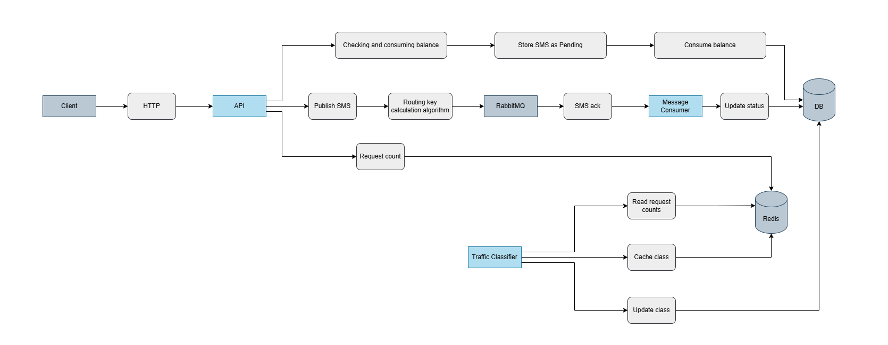

# SMS Gateway Service

# Table of Contents

- [Overview](#overview)
- [Features](#features)
- [Architecture](#architecture)
- [Traffic Classification Algorithm](#traffic-classification-algorithm)
- [Idempotency](#idempotency)
- [Design Decisions](#design-decisions)
- [RabbitMQ Topology](#rabbitmq-topology)
- [Project Structure](#project-structure)
- [Running the Project](#running-the-project)
- [API Endpoints](#api-endpoints)
- [Future Improvements](#future-improvements)

---
## Overview

SMS Gateway Service is a distributed backend service responsible for receiving SMS requests, routing them for delivery, tracking their delivery status, and dynamically classifying users based on traffic patterns.

The service is designed to support high-throughput workloads by separating responsibilities into independent applications communicating through RabbitMQ while using PostgreSQL for persistence and Redis for caching and traffic analysis.


---

## Features

- Asynchronous SMS processing using RabbitMQ
- Single and concurrent batch SMS submission
- Dynamic user traffic classification (Standard / Bulk)
- Intelligent queue routing based on traffic class and message priority
- Delivery status tracking through acknowledgement events
- User balance management with atomic updates
- Idempotent SMS submission using client identifiers
- Redis-backed caching and distributed request counters
- Daily partitioned PostgreSQL tables for high-volume SMS storage
- Background workers for traffic classification and delivery processing
- Manual dependency injection with a centralized application container
- OpenAPI (Swagger) documentation
- Structured logging with Zap
- Dockerized applications with Kubernetes deployment support

---

# Architecture

The system is composed of three independent applications.

| Application | Responsibility |
|--------------|---------------|
| API | Receives HTTP requests, validates them, stores SMS records, publishes messages to RabbitMQ |
| Traffic Classifier | Periodically analyzes request history and classifies users as Standard or Bulk |
| Message Consumer | Consumes SMS delivery acknowledgements and updates message status |

Each application shares the same dependency wiring while containing only the logic required for its responsibility.

The following diagram illustrates the high-level architecture of the system, showing how the three applications interact with PostgreSQL, Redis, RabbitMQ, and the external SMS provider. It also highlights the overall message flow from the API through delivery acknowledgement.




---

## Traffic Classification Algorithm

The system automatically classifies users as **Standard** or **Bulk** senders based on their recent SMS traffic.

- Every SMS request increments an **hourly counter** in Redis.
- A background **Traffic Classifier** periodically reads each user's request counts for the **last 4 hours** using Redis.
- If **any** hourly count reaches or exceeds the configured threshold (**500 requests/hour**), the user is classified as **Bulk**; otherwise, the user remains **Standard**.
- Only users whose traffic class has changed are updated. The classifier performs a **bulk database update** and refreshes the Redis cache using a pipeline to minimize database writes and network round trips.

The user's traffic class is then used to determine the RabbitMQ routing key:

| Traffic Class | Ordinary | Express |
|---------------|----------|----------|
| Standard | `standard` | `standard.express` |
| Bulk | `bulk` | `bulk.express` |

This approach enables high-volume users to be routed through dedicated queues while keeping routing decisions fast through Redis caching.

---

# Design Decisions

### Availability over Consistency

For SMS submission, the system prioritizes **availability** over **strong consistency**. The API aims to accept and enqueue requests quickly rather than coupling request processing to multiple distributed operations.

To keep the request path lightweight:

- SMS publishing is asynchronous through RabbitMQ.
- The system does not implement the Transactional Outbox pattern.
- Database writes and message publishing are not wrapped in a distributed transaction.
- Client-provided IDs are accepted without enforcing global uniqueness, avoiding additional coordination on the write path.

In contrast, operations that directly affect business correctness, such as **user balance validation and deduction**, prioritize consistency. These operations rely on atomic database updates to prevent overspending and race conditions under concurrent requests.

This separation allows the system to maximize throughput for high-volume SMS processing while maintaining correctness where it directly impacts user state.

### Manual Dependency Injection

The project uses manual dependency injection with a centralized application container acting as the composition root. Shared infrastructure and business services are created once and injected into each application, keeping dependency wiring explicit, avoiding global state, and simplifying testing and maintenance.

### Traffic Classifier

The **Traffic Classifier** runs as a separate background application responsible for identifying high-volume users. Running this process independently keeps the HTTP API lightweight and avoids expensive traffic analysis during request processing.

User traffic is evaluated over a **4-hour sliding window** using hourly request counters stored in Redis.

The threshold was selected based on the expected workload. With approximately **1 million SMS per day** distributed across **50,000 users**, the average user sends roughly **20 SMS per day** (less than **1 SMS per hour**). A threshold of **500 SMS/hour** therefore represents a significant traffic spike rather than normal activity, allowing genuinely high-volume senders to be routed to dedicated queues without affecting regular users.

A **4-hour window** was chosen to balance responsiveness and stability. It allows the system to react quickly to sustained increases in traffic while avoiding frequent traffic class changes caused by short-lived spikes.

These values are intended as sensible defaults rather than fixed rules. As more production traffic becomes available, they can be adjusted using observed user behavior, traffic distributions, and system performance metrics.

### Message Consumer

The **Message Consumer** runs as an independent background application responsible for processing delivery acknowledgements from RabbitMQ and updating SMS statuses in PostgreSQL.

Separating acknowledgement processing from the HTTP API prevents delivery updates from impacting request latency and allows consumers to scale independently based on message throughput.


### Bulk Operations

High-volume updates, such as traffic classification changes, are performed using bulk database updates and Redis pipelining to reduce network overhead and improve performance.

### RabbitMQ

RabbitMQ was chosen to decouple the HTTP API from SMS delivery, allowing requests to be processed asynchronously without blocking clients. It provides flexible routing through exchanges and routing keys, making it straightforward to separate traffic into Standard/Bulk and Ordinary/Express queues without changing application code.

RabbitMQ also offers reliable message delivery, acknowledgements, retries, dead-letter queues, and horizontal scaling through multiple consumers, making it well suited for high-throughput messaging workloads.

### Redis

Redis is used as the primary caching layer due to its extremely low latency and in-memory architecture. It stores user traffic classifications and hourly request counters, eliminating unnecessary database queries from the critical request path.

Redis also enables distributed state management, allowing multiple API instances to share the same counters and cached values consistently. Atomic operations such as `INCRBY` make it ideal for tracking request volumes without introducing race conditions, while key expiration naturally removes outdated traffic data.

### PostgreSQL

PostgreSQL was selected as the primary datastore because of its strong ACID guarantees, transactional consistency, and mature relational capabilities. Since SMS records and user balances are business-critical data, correctness and reliability take priority over eventual consistency.

The SMS table is range-partitioned by day to support high write throughput while keeping indexes small and improving query performance for time-based data. PostgreSQL's native partitioning, indexing, and query planner make it well suited for large append-only datasets such as SMS history.

PostgreSQL was preferred over MySQL due to its mature partitioning support, richer SQL capabilities, and suitability for large transactional workloads.

---

# RabbitMQ Topology

Messages are routed through RabbitMQ using routing keys based on the user's traffic class and SMS priority, allowing Standard/Bulk and Ordinary/Express traffic to be processed independently.

## Exchanges

### SMS Dispatch

```
sms.dispatch
```

### SMS Acknowledgements

```
sms.ack
```

---

## Dispatch Queues

```
sms.standard.ordinary
sms.standard.express
sms.bulk.ordinary
sms.bulk.express
```

---

## Acknowledgement Queue

```
sms.ack
```

---

# Project Structure

```
cmd/
├── api/                      # HTTP API application
├── traffic_classifier/       # Background service for user traffic classification
└── message_consumer/         # RabbitMQ ACK consumer

internals/
├── app/                      # Application bootstrap, dependency injection and application factory
├── cache/                    # Redis client, cache helpers and key definitions
├── config/                   # Environment configuration loading
├── database/                 # PostgreSQL connection and migrations
├── dtos/                     # Internal DTOs used between layers
├── http/
│   ├── handlers/             # HTTP handlers
│   ├── middleware/           # HTTP middleware
│   ├── requests/             # Request models
│   ├── responses/            # Response models
│   ├── routes/               # Route registration
│   └── errors/               # Domain and HTTP error definitions
├── logger/                   # Zap logger configuration
├── message_broker/           # RabbitMQ publishers, consumers and topology
├── middlewares/             # Shared middleware (rate limiting, etc.)
├── models/                   # Database models (GORM)
├── repositories/             # Data access layer
├── services/                 # Business logic
└── value_objects/            # Domain value objects and enums

deployments/
└── docker-compose.yml        # Local development infrastructure

migrations/                   # SQL database migrations
```

---
# Running the Project

Run each application in a separate terminal after starting the infrastructure.

## Start Infrastructure

```bash
docker compose -f deployments/docker-compose.yml up -d
```

---

## Run API

```bash
go run ./cmd/api
```

---

## Run Traffic Classifier

```bash
go run ./cmd/traffic_classifier
```

---

## Run Message Consumer

```bash
go run ./cmd/message_consumer
```

---

# API Endpoints

| Method | Endpoint | Description |
|---------|----------|-------------|
| GET | `/user/:id` | Get user information |
| PUT | `/user/:id/balance` | Increase user balance |
| POST | `/sms` | Send a single SMS |
| POST | `/sms/batch` | Send multiple SMS messages |
| GET | `/sms/report?user_id={id}` | Get SMS report for a user |

Swagger UI is available at:

```
http://localhost:8080/swagger/index.html
```

---

## Future Improvements

- Transactional Outbox Pattern for guaranteed RabbitMQ delivery
- Retry and dead-letter queues
- Automatic partition creation and cleanup
- Prometheus metrics
- Distributed tracing (Jaeger)
- Authentication and authorization
- Integration and end-to-end tests